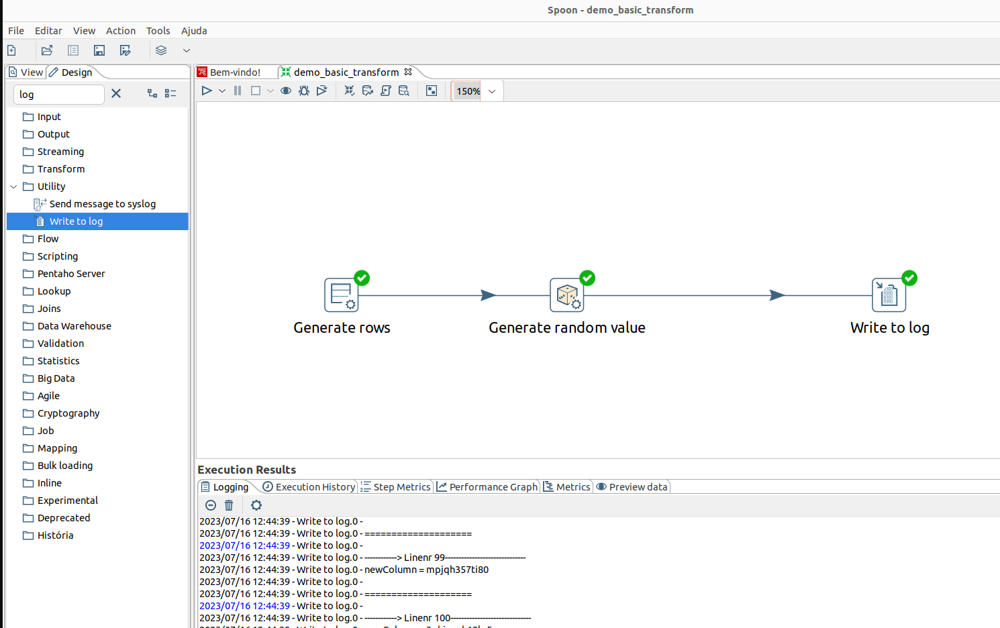
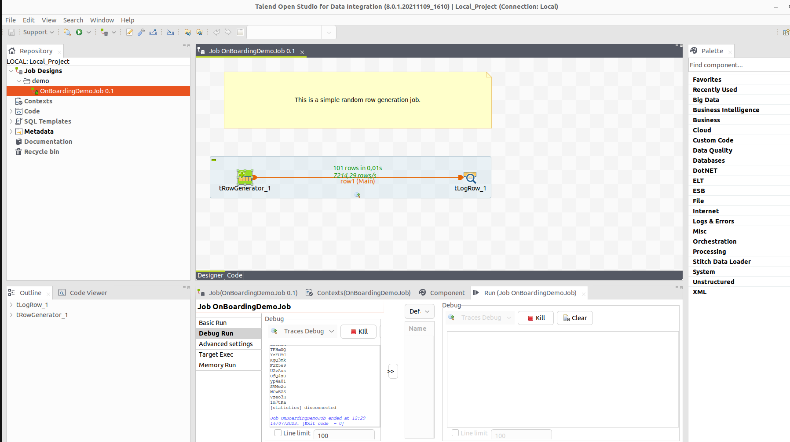
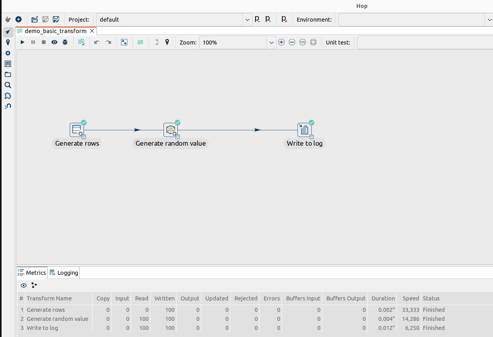

# Inception ETL Tools.
Travels of a Data Engineer with ETL Tools Migration Issue

Starting with the question of the best way to migrate ETLs from Pentaho Data Integration to Talend using Apache Hop :)

The great difficulty of migrating from one ETL model to another is the way each of the tools resolved its data transformation, in one of our basic tests (Pentaho to Talend) it is clear that we will not be able to perform a migration from 1 step to 1 step , we will have to understand the whole context of the ETL , in the example documented here, 3 steps in Pentaho became 2 steps in Talend (see below)

Resume:
 To build an automated ETL migration your team or you must be an excellent connoisseur of both the features of the source tool and the target tool, it's no use being an average user. 
 
## Sample Project.

All similar Projects write in differet ETL Tools.
 
Escope:
1) Generate 100 rows with name newColumn and random string data.
2) Stream the data in ETL.
3) Write a log of data. 

### Pentaho Data Integration - Sample Simple Project.
Generate 100 rows, create a colunm with name newColumn with Step Random Value, write a log.

 
### Talend - Sample Simple Project.
Generate 100 rown with name newColumn and exec a function TalendString.getAsciiRandomString(int) from value random and write a log. 

### Apache Hop - Sample Simple Project.
Generate 100 rows, create a colunm with name newColumn with Step Random Value, write a log.

# Roadmap.
This project is currently being developed around a curiosity, and has no intention of becoming a product at the moment, but if you want to sponsor its development, it will be a challenge that we would like to be together.

- Version 0.01 - Developed models for comparing XML and artefacts from Apache Hop, Pentaho Data Integration and Talend tools. 
- Version 0.02 - Migrate Sample ETL Pentaho to Talend (in process)...

# License.
Apache License 2.0
